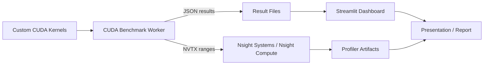

# BenchSight Architecture

## Goal

BenchSight is a presentation-first GPU benchmarking workflow. The current architecture is intentionally simple: custom CUDA kernels produce structured benchmark results, and a Streamlit dashboard turns those results into presentation-ready comparisons.

## System Overview

## Main Components

### `workers/cuda-benchmarks`

- Implements the baseline and optimized CUDA kernels
- Runs warmup iterations and timed trials
- Measures execution with CUDA events
- Adds NVTX ranges for profiler visibility
- Exports structured JSON result files

### `simple_dashboard`

- Loads local JSON benchmark results
- Visualizes latency, throughput, and speedup
- Compares baseline and optimized implementations
- Provides a presentation-friendly UI for reviewers

### `profiling`

- Stores request files for profiler runs
- Stores Nsight output artifacts and screenshots
- Connects profiler evidence to benchmark comparisons

### `presentation`

- Contains project-flow visuals
- Contains slide-by-slide speaking notes
- Contains quick-learn notes and likely questions

## Execution Flow

1. Select a workload and implementation.
2. Run the worker with warmup iterations and timed trials.
3. Compute average latency, p50, p95, throughput, and speedup.
4. Export the benchmark output as JSON.
5. Load the JSON into the Streamlit dashboard.
6. Profile the same workload with Nsight Systems and Nsight Compute.
7. Present benchmark charts together with profiler evidence.

## Why This Architecture Works

- It keeps the project focused on the benchmark methodology.
- It avoids unnecessary backend and frontend complexity.
- It is easier to run, explain, and present in a short demo.
- It still leaves room for future expansion such as library references or a backend control plane.
